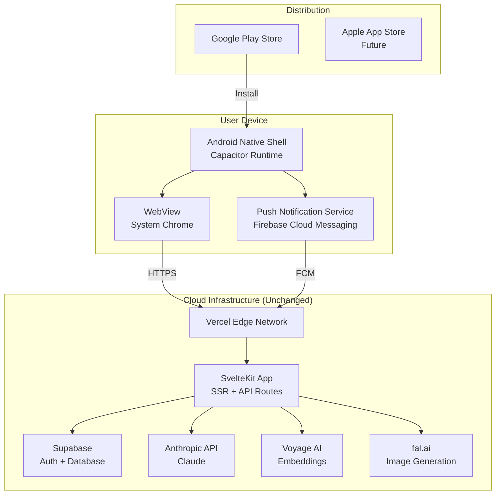
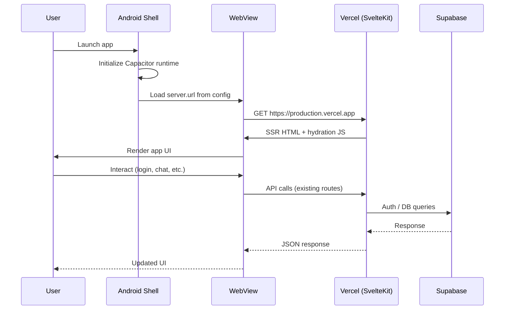
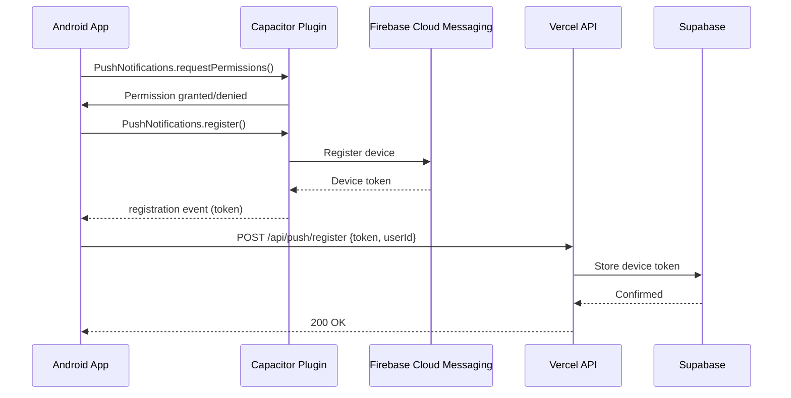
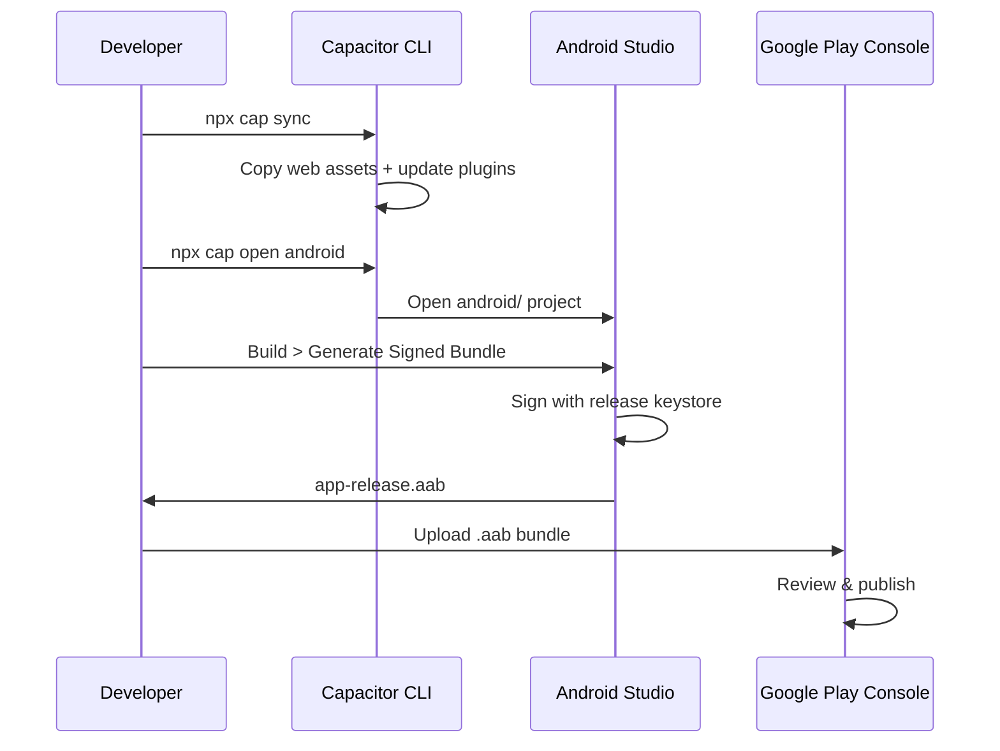

# Design Document: Android Deployment Handoff

## Overview

This feature wraps the existing SvelteKit application (deployed on Vercel) inside a native Android shell using Capacitor. Rather than rewriting server-side API routes as client-side calls, the native app loads the live Vercel deployment URL directly. The server-side logic (Anthropic, Supabase, rate limiting) remains untouched while the Android shell provides app store presence, device API access, and push notifications.

Push notifications are included as a native capability to satisfy app store policies against thin URL wrappers. Conversation reminders and follow-up prompts provide genuine native value. The architecture is designed to extend to iOS with minimal additional configuration once Android is working.

## Architecture



## Component Architecture

```mermaid
graph LR
    subgraph "Project Root"
        CAP[capacitor.config.ts]
        PKG[package.json]
    end

    subgraph "Static Assets"
        MAN[manifest.json]
        ICO[icons/]
    end

    subgraph "Android Platform (Generated)"
        GRADLE[build.gradle]
        MANIFEST[AndroidManifest.xml]
        MAIN[MainActivity.java]
        KEY[release.keystore]
    end

    subgraph "Native Plugins"
        PUSH[@capacitor/push-notifications]
        CORE[@capacitor/core]
    end

    CAP --> GRADLE
    CAP --> MANIFEST
    PUSH --> MAIN
    CORE --> MAIN
```

## Sequence Diagrams

### App Launch Flow



### Push Notification Registration Flow



### Build & Release Flow



## Components and Interfaces

### Component 1: Capacitor Configuration

**Purpose**: Defines the bridge between the native Android shell and the remote SvelteKit application. Controls how the WebView loads content and which native plugins are available.

**Interface**:
```typescript
interface CapacitorConfig {
  appId: string;           // Reverse-domain app identifier (immutable after first submission)
  appName: string;         // Display name on device
  webDir: string;          // Local fallback directory (unused in remote mode)
  server: {
    url: string;           // Production Vercel URL loaded by WebView
    cleartext: boolean;    // false — HTTPS only
  };
  plugins?: {
    PushNotifications?: {
      presentationOptions: string[];  // ["badge", "sound", "alert"]
    };
  };
}
```

**Responsibilities**:
- Map app identity to Play Store registration
- Point WebView at live Vercel deployment
- Configure native plugin behavior

---

### Component 2: Native Android Shell

**Purpose**: Generated Android project that hosts the Capacitor WebView and provides native platform integration.

**Interface**:
```typescript
interface AndroidProject {
  // Generated structure
  'app/src/main/java/.../MainActivity.java': NativeActivity;
  'app/src/main/AndroidManifest.xml': ManifestConfig;
  'app/build.gradle': BuildConfig;
  'app/src/main/res/': ResourceDirectories;
}

interface ManifestConfig {
  package: string;                    // com.pocketdatingcoach.app
  permissions: string[];              // INTERNET, POST_NOTIFICATIONS
  launchMode: 'singleTask';
  orientation: 'portrait';
}

interface BuildConfig {
  compileSdk: number;                 // 34
  minSdk: number;                     // 22 (Android 5.1+)
  targetSdk: number;                  // 34
  versionCode: number;                // Increment each release
  versionName: string;                // Semantic version
  signingConfigs: SigningConfig;
}
```

**Responsibilities**:
- Host WebView with Capacitor runtime
- Manage Android lifecycle events
- Handle deep links and back navigation
- Provide native permissions UI

---

### Component 3: Push Notification Plugin

**Purpose**: Provides native push notification capability via Firebase Cloud Messaging. Satisfies app store "thin wrapper" policy by adding genuine native functionality.

**Interface**:
```typescript
interface PushNotificationService {
  // Client-side (runs in WebView via Capacitor bridge)
  requestPermissions(): Promise<PermissionStatus>;
  register(): Promise<void>;
  getDeliveredNotifications(): Promise<Notification[]>;
  removeAllDeliveredNotifications(): Promise<void>;

  // Events
  onRegistration(callback: (token: Token) => void): void;
  onRegistrationError(callback: (error: Error) => void): void;
  onPushNotificationReceived(callback: (notification: PushNotification) => void): void;
  onPushNotificationActionPerformed(callback: (action: ActionPerformed) => void): void;
}

interface Token {
  value: string;  // FCM device token
}

interface PushNotification {
  title: string;
  body: string;
  data: Record<string, string>;  // Custom payload (e.g., conversationId)
}
```

**Responsibilities**:
- Request notification permissions from user
- Register device with FCM and obtain token
- Forward token to backend for storage
- Handle incoming notifications (foreground and background)
- Navigate to relevant screen on notification tap

---

### Component 4: Release Signing & Distribution

**Purpose**: Manages cryptographic signing of release builds and submission to Google Play Store.

**Interface**:
```typescript
interface ReleaseConfig {
  keystore: {
    path: string;              // Absolute path to .jks file
    storePassword: string;     // Keystore password
    keyAlias: string;          // Key alias within keystore
    keyPassword: string;       // Key password
  };
  buildType: 'release';
  bundleFormat: 'aab';         // Android App Bundle (required by Play Store)
}

interface PlayStoreSubmission {
  packageName: string;         // com.pocketdatingcoach.app
  track: 'internal' | 'alpha' | 'beta' | 'production';
  releaseBundle: string;       // Path to .aab file
  storeListing: StoreListing;
}

interface StoreListing {
  title: string;               // Max 30 chars
  shortDescription: string;    // Max 80 chars
  fullDescription: string;     // Max 4000 chars
  screenshots: Screenshot[];   // Min 2, phone + 7-inch tablet
  featureGraphic: string;      // 1024x500 PNG
  icon: string;                // 512x512 PNG
  category: string;            // e.g., "Lifestyle"
  contentRating: string;       // IARC questionnaire result
  privacyPolicyUrl: string;
}
```

**Responsibilities**:
- Generate and securely store release keystore
- Sign AAB bundles for Play Store submission
- Manage version codes across releases
- Maintain store listing metadata

## Data Models

### Capacitor Config (capacitor.config.ts)

```typescript
interface CapacitorConfig {
  appId: 'com.pocketdatingcoach.app';
  appName: 'Pocket Dating Coach';
  webDir: 'build';
  server: {
    url: string;       // Production Vercel URL
    cleartext: false;
  };
  plugins: {
    PushNotifications: {
      presentationOptions: ['badge', 'sound', 'alert'];
    };
  };
}
```

**Validation Rules**:
- `appId` must be reverse-domain format, cannot change after first Play Store submission
- `server.url` must be valid HTTPS URL
- `cleartext` must be `false` (no HTTP in production)
- `webDir` is required by Capacitor but unused when `server.url` is set

---

### Device Token Registration (API payload)

```typescript
interface DeviceTokenPayload {
  userId: string;        // Supabase auth user ID
  token: string;         // FCM device token
  platform: 'android' | 'ios';
  createdAt: string;     // ISO 8601 timestamp
}
```

**Validation Rules**:
- `userId` must correspond to authenticated Supabase user
- `token` must be non-empty string from FCM
- `platform` determines notification delivery channel
- Tokens should be refreshed on app launch (FCM tokens can rotate)

---

### Push Notification Payload (Server → FCM)

```typescript
interface NotificationPayload {
  to: string;            // FCM device token
  notification: {
    title: string;       // e.g., "Time to follow up!"
    body: string;        // e.g., "It's been 2 days since your last message to Sarah"
  };
  data: {
    type: 'conversation_reminder' | 'follow_up_prompt' | 'profile_tip';
    conversationId?: string;
    deepLink?: string;   // In-app route to navigate to
  };
}
```

**Validation Rules**:
- `to` must be a valid, non-expired FCM token
- `notification.title` max 65 chars (Android truncation)
- `notification.body` max 240 chars
- `data.type` determines notification handling behavior

---

### File Structure Model

```typescript
interface ProjectFileChanges {
  new: [
    'capacitor.config.ts',           // Capacitor configuration
    'static/icons/icon-192.png',     // Standard icon (if not already present)
    'static/icons/icon-512.png',     // High-res icon (if not already present)
    'android/',                       // Generated native project
  ];
  modified: [
    'package.json',                  // New dependencies added
    'static/manifest.json',          // Already exists, may need icon path updates
  ];
  unchanged: [
    'src/',                          // All SvelteKit source code
    'svelte.config.js',             // Adapter-vercel config
    '.env.*',                        // Environment variables
    'src/routes/api/',              // All API routes
  ];
}
```

## Correctness Properties

*A property is a characteristic or behavior that should hold true across all valid executions of a system — essentially, a formal statement about what the system should do. Properties serve as the bridge between human-readable specifications and machine-verifiable correctness guarantees.*

### Property 1: Config Immutability

*For any* sequence of builds produced for the same Play Store listing, the `appId` value in Capacitor_Config SHALL be identical across all builds and SHALL match the reverse-domain format (`com.pocketdatingcoach.app`).

**Validates: Requirements 1.1**

### Property 2: HTTPS Enforcement

*For any* URL that the WebView attempts to load or navigate to, the protocol SHALL be HTTPS. No HTTP requests are permitted regardless of the URL path or origin.

**Validates: Requirements 1.3, 3.5, 11.1**

### Property 3: Server Logic Isolation

*For any* file in `src/routes/api/`, `svelte.config.js`, or `.env.*`, the file content SHALL remain unchanged after Capacitor integration. The set of modified files is limited to `package.json`, `static/manifest.json`, and newly created Capacitor-specific files.

**Validates: Requirements 1.4**

### Property 4: Push Token Validity

*For any* Device_Token stored in the database, there SHALL exist a corresponding authenticated Supabase user whose ID matches the token's `userId` field. Tokens without valid user associations SHALL be rejected at registration time.

**Validates: Requirements 4.3, 5.1, 5.4**

### Property 5: Notification Payload Bounds

*For any* notification payload constructed by the Backend, the title SHALL not exceed 65 characters, the body SHALL not exceed 240 characters, and the `type` discriminator SHALL be one of: `conversation_reminder`, `follow_up_prompt`, or `profile_tip`.

**Validates: Requirements 6.1, 6.2, 6.3, 6.4**

### Property 6: Keystore Consistency

*For any* two release builds targeting the same `appId`, both SHALL be signed with the same keystore and key alias. Additionally, for any sequence of releases, the `versionCode` SHALL be strictly monotonically increasing.

**Validates: Requirements 7.1, 7.3**

### Property 7: Offline Graceful Degradation

*For any* app state and any sequence of user interactions while the device has no network connectivity, the Android_Shell SHALL not crash or produce unhandled exceptions. The app SHALL remain in a recoverable error state.

**Validates: Requirements 9.1, 9.3**

### Property 8: Platform Extensibility

*For any* valid Capacitor_Config, the configuration SHALL contain no platform-specific fields that would require modification when adding iOS support. The push notification registration payload SHALL accept both `android` and `ios` as valid platform identifiers.

**Validates: Requirements 10.1, 10.3**

### Property 9: Domain Restriction

*For any* navigation attempt to a URL whose origin differs from the configured `server.url` origin, the WebView SHALL block the navigation. Only the production Vercel_URL origin is permitted.

**Validates: Requirements 3.2, 11.3**

### Property 10: No Secrets in Client Bundle

*For any* string contained in the built AAB or APK, the string SHALL not match patterns for server-side API keys (Anthropic, Supabase service role, Voyage AI, fal.ai). No secrets are embedded in the client distribution.

**Validates: Requirements 11.2**

## Error Handling

### Error Scenario 1: Network Unavailable on Launch

**Condition**: Device has no internet connection when app launches
**Response**: WebView shows native Android network error page. Capacitor does not provide offline fallback since the app depends entirely on the remote server.
**Recovery**: App automatically retries when connectivity is restored. Consider adding a custom offline HTML page in `webDir` as a fallback splash.

### Error Scenario 2: FCM Token Registration Failure

**Condition**: Push notification registration fails (permissions denied, FCM unreachable, or backend rejects token)
**Response**: App continues functioning without push notifications. Error logged but not surfaced to user.
**Recovery**: Re-attempt registration on next app launch. If permissions denied, prompt user via in-app banner on subsequent sessions.

### Error Scenario 3: WebView SSL/TLS Error

**Condition**: Certificate mismatch or expired cert on Vercel URL
**Response**: WebView blocks navigation and shows security warning
**Recovery**: Requires Vercel certificate renewal. No client-side workaround (cleartext is disabled).

### Error Scenario 4: App Store Rejection — Thin Wrapper

**Condition**: Google Play review flags app as a thin URL wrapper with insufficient native functionality
**Response**: Push notifications plugin must be fully integrated and demonstrably functional before submission
**Recovery**: Ensure notification permission flow is triggered during onboarding. Add additional native features if needed (e.g., haptic feedback, share sheet integration).

### Error Scenario 5: Keystore Loss

**Condition**: Release keystore file or passwords are lost
**Response**: Cannot publish updates to the same Play Store listing. App effectively orphaned.
**Recovery**: Prevention only — store keystore in secure, backed-up location (e.g., encrypted cloud storage). Document passwords in password manager. Consider Google Play App Signing (lets Google hold the upload key).

## Testing Strategy

### Unit Testing Approach

- **Capacitor config validation**: Verify config structure matches expected schema
- **Push notification registration logic**: Mock Capacitor plugin APIs, verify token forwarding to backend
- **Notification payload construction**: Verify server-side payloads conform to FCM format

Use existing vitest + fast-check setup for property-based testing of notification payloads.

### Property-Based Testing Approach

**Property Test Library**: fast-check (already installed)

- **Notification payload properties**: For all valid user IDs and conversation states, generated notification payloads must have title ≤ 65 chars, body ≤ 240 chars, and valid `type` discriminator
- **Config invariants**: `appId` format always matches reverse-domain regex, `server.url` always valid HTTPS URL

### Integration Testing Approach

- **WebView loading**: Verify Vercel URL loads successfully in Android emulator
- **Push notification end-to-end**: Send test notification via FCM console, verify delivery on emulator
- **Deep link navigation**: Verify notification tap navigates to correct in-app route
- **Offline behavior**: Verify graceful degradation when network is unavailable

### Manual Testing Checklist

- App installs from generated .aab on physical device
- All existing app functionality works through WebView (auth, chat, profile review)
- Push notification permission prompt appears
- Notifications received in foreground and background
- Notification tap opens correct screen
- Back button behavior is correct (doesn't exit app unexpectedly)
- App survives process death and recreation

## Performance Considerations

- **Cold start time**: Capacitor adds ~200-400ms to initial launch before WebView begins loading. The remote URL then has standard web loading time. Consider a branded splash screen during load.
- **WebView memory**: System WebView (Chrome-based) handles memory management. No additional optimization needed for this wrapper pattern.
- **Network dependency**: All functionality requires network. First meaningful paint depends on Vercel response time + CDN cache status. Edge network (Vercel) mitigates latency for most regions.
- **Bundle size**: The .aab is minimal (~5-10MB) since no web assets are bundled. Play Store delivery is fast.

## Security Considerations

- **HTTPS only**: `cleartext: false` enforces TLS for all WebView traffic. No HTTP fallback.
- **Keystore security**: Release keystore must be stored outside version control. Use `.gitignore` for `*.jks` and `*.keystore` files. Store passwords in a secrets manager.
- **FCM token handling**: Device tokens are PII-adjacent. Store in Supabase with RLS policies scoped to the owning user. Tokens should be invalidated on logout.
- **WebView security**: Capacitor's default WebView configuration prevents navigation to external domains. Only the configured `server.url` origin is trusted.
- **No secrets in client**: All API keys (Anthropic, Supabase service role, Voyage) remain server-side on Vercel. The Android app never sees them.

## Dependencies

| Dependency | Version | Purpose |
|---|---|---|
| `@capacitor/core` | ^6.x | Capacitor runtime bridge |
| `@capacitor/cli` | ^6.x | CLI tooling (sync, open, build) |
| `@capacitor/android` | ^6.x | Android platform support |
| `@capacitor/push-notifications` | ^6.x | FCM push notification plugin |
| Android Studio | Latest stable | Build tooling, emulator, signing |
| JDK | 17+ | Android build requirement |
| Firebase project | — | FCM configuration (google-services.json) |

### Future Dependencies (iOS)

| Dependency | Version | Purpose |
|---|---|---|
| `@capacitor/ios` | ^6.x | iOS platform support |
| Xcode | Latest stable | iOS build tooling |
| Apple Developer Account | — | App Store submission ($99/year) |
