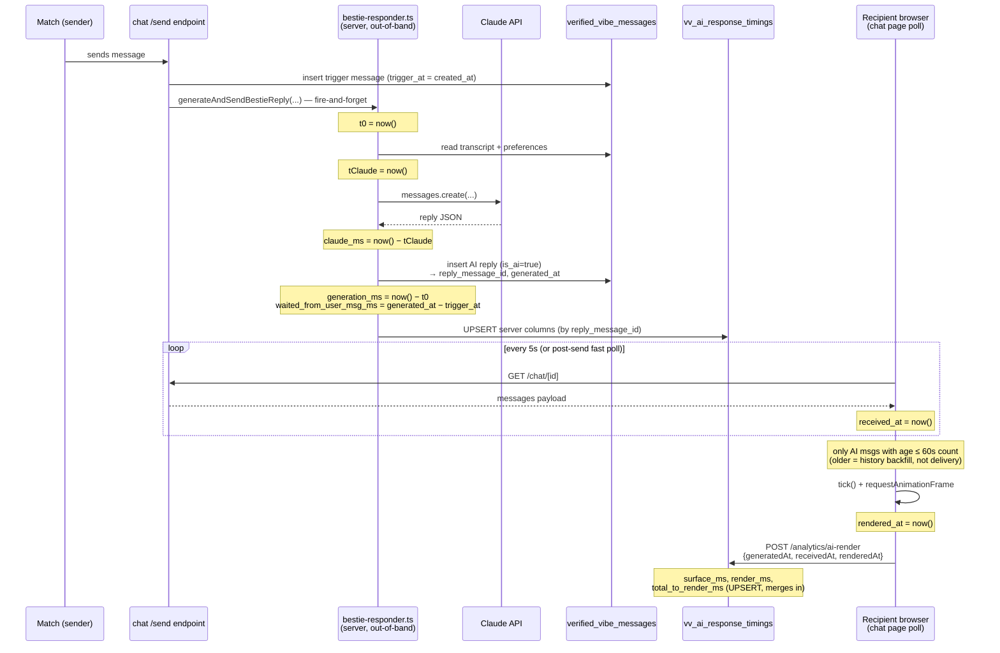

# AI Latency Metrics

How the **AI Latency** tab in the admin analytics dashboard (`/admin/analytics`) is
derived — the event flow that produces the data, the table that stores it, and the
exact formula behind every number on screen.

The tab measures lag for **AI Bestie auto-responses**: from a user's message landing
on the server, through generation, delivery over the poll, and paint on the
recipient's screen. Each measured response is one row in `vv_ai_response_timings`.

---

## 1. Event flow

A single AI reply is measured in two halves by two different actors:

- **Server half** — written when the Bestie reply is generated (the female user the
  Bestie acts for is offline/out-of-band).
- **Client half** — written by the **recipient's** browser once the reply is polled
  in and painted.

They are joined on `reply_message_id` (an upsert, so order doesn't matter — whichever
half lands first creates the row, the other merges in).



### Source files

| Stage | File | Key lines |
|---|---|---|
| Server generation + server-column write | `src/lib/server/bestie-responder.ts` | `generateAndSendBestieReply` 166–232; `claude_ms` 130/148 |
| Client poll + received/rendered stamp | `src/routes/verified-vibe/chat/[conversationId]/+page.svelte` | `pollOnce` 1000–1090; `reportAiRenderTiming` 1117–1133; age gate `MAX_DELIVERY_AGE_MS` 51 |
| Client-column write (derive + upsert) | `src/routes/api/verified-vibe/analytics/ai-render/+server.ts` | 18–76 |
| Dashboard read + aggregation | `src/routes/admin/analytics/+page.server.ts` | query 27–30; message join 84–95; `buildAiLatency` 182–246 |
| Dashboard render | `src/routes/admin/analytics/+page.svelte` | KPI cards 676–697; table 711–745 |

---

## 2. Data schema

Table `vv_ai_response_timings` — one row per AI reply, keyed by the reply message id.
Migration: `supabase/migrations/20260601_ai_response_timings.sql`.

| Column | Type | Written by | Meaning |
|---|---|---|---|
| `id` | uuid PK | default | row id |
| `reply_message_id` | uuid **unique** | server (or client if first) | join key — the AI reply message |
| `match_id` | uuid | both | the chat thread |
| `response_type` | text | both | `'bestie'` |
| **— server stage —** | | | |
| `trigger_message_id` | uuid | server | the user's message that triggered the reply |
| `trigger_at` | timestamptz | server | when the user's message hit the DB |
| `generated_at` | timestamptz | server | when the AI reply was stored (its `created_at`) |
| `generation_ms` | integer | server | full server cost: DB reads + Claude + write |
| `claude_ms` | integer | server | Claude API call only |
| `waited_from_user_msg_ms` | integer | server | `generated_at − trigger_at` |
| **— client stage —** | | | |
| `received_at` | timestamptz | client | when the recipient's poll first surfaced it |
| `rendered_at` | timestamptz | client | when it painted on screen |
| `surface_ms` | integer | client | `received_at − generated_at` (delivery / poll gap) |
| `render_ms` | integer | client | `rendered_at − received_at` (paint cost) |
| `total_to_render_ms` | integer | client | `rendered_at − generated_at` |
| `created_at` | timestamptz | default `now()` | row insert time |

RLS is enabled; the dashboard reads via the service role only.

---

## 3. Metric lineage

Each dashboard metric, its source columns, the timestamps behind them, and where the
math happens. All five appear both as a KPI card (aggregated) and as a per-row column.

| Metric (UI label) | Column | Formula | Stamped where |
|---|---|---|---|
| **Generation** | `generation_ms` | `now() − t0`, where `t0` is the start of `generateAndSendBestieReply` | bestie-responder.ts:175,211 |
| **Claude API** | `claude_ms` | `now() − tClaude` around the single `messages.create` call | bestie-responder.ts:130,148 |
| **Delivery** | `surface_ms` | `received_at − generated_at` (poll gap) | ai-render/+server.ts:43–44 |
| **Render** | `render_ms` | `rendered_at − received_at` (DOM paint) | ai-render/+server.ts:45 |
| **End-to-end** | derived | `waited_from_user_msg_ms + total_to_render_ms` | +page.server.ts:203 |

### Two subtleties worth knowing

**End-to-end uses `waited_from_user_msg_ms`, not `generation_ms`.** `generation_ms` is
wall time *inside* the responder (after the trigger message is already in the DB).
`waited_from_user_msg_ms` is `generated_at − trigger_at`, which also includes any queue
delay before the responder started. End-to-end is the honest user-felt number:

```
end_to_end = (trigger_at → generated_at)        # waited_from_user_msg_ms
           + (generated_at → rendered_at)        # total_to_render_ms
           = trigger_at → rendered_at            # user's message → painted
```

It is `null` (shown as `—`) unless **both** halves exist.

**The 60-second staleness clamp can null end-to-end even when delivery looks fine.**
`total_to_render_ms` is dropped if it exceeds 60s (see §4). So a reply with a slow
render — e.g. the 37.0s delivery / 70.0s render sample row — has
`total ≈ 107s → null`, which makes end-to-end `—` even though generation, delivery and
render all rendered values. The dash is correct: there is no trustworthy
message-to-screen number for that response.

---

## 4. Filters, clamps, and gates

Three guards keep the table honest. They exist because a recipient (re)opening a thread
backfills old history, which would otherwise masquerade as huge "delivery" times.

| Guard | Where | Rule | Effect |
|---|---|---|---|
| **Client age gate** | chat +page.svelte:1056 (`MAX_DELIVERY_AGE_MS = 60000`) | Only AI messages younger than 60s when surfaced get a render report at all | Backfilled history is never reported |
| **Write-time clamp** | ai-render/+server.ts:42–47 | `surface_ms` / `total_to_render_ms` over 60s are stored as `null` | Staleness ≠ delivery |
| **Read-time clamp** | +page.server.ts:180,186–188 (`MAX_DELIVERY_MS = 60000`) | Same 60s ceiling re-applied at display, defends older/raw rows | Old rows can't skew stats |
| **Orphan filter** | +page.server.ts:185 (`measured`) | Rows with `generation_ms IS NULL` are dropped entirely | Render-only pings (no server half) don't clutter the table or stats |

> The orphan filter is why pre-instrumentation AI messages (generated before
> 2026-06-01) no longer appear: the client may report their render timing, but with no
> server-generation row they are `generation_ms IS NULL` and excluded.

---

## 5. Dashboard aggregation

`buildAiLatency` (`+page.server.ts:182`) turns the surviving rows into the view:

1. **Filter** orphans (`generation_ms IS NULL`).
2. **Map** each row → `AiLatencyRecord`, joining the reply text by `reply_message_id`
   (loaded in the page `load`, 84–95) and re-applying the 60s clamp to
   `surface_ms` / `total_to_render_ms`.
3. **Group** by `match_id` into chat sessions (one card per thread), newest first.
4. **Aggregate** each stage with `stat()` (170–176): `n`, `avg`, `p50`, `p95`, `max`.
   - `p50`/`p95` are nearest-rank percentiles over the non-null, finite values only.
   - Each stage aggregates independently, so `n` differs per stage (a row missing
     `render_ms` still contributes its `generation_ms`).

The KPI cards show the **global** stats across all sessions; each session card shows its
own per-thread `avg e2e` / `avg delivery`. The per-row table additionally shows the
**Message** (reply text + `reply_message_id`) so every measurement is traceable to the
exact message. Cell color cues: delivery > 3s → amber; end-to-end > 15s → rose.

---

## 6. Worked example

The sample row in the screenshot (`reply_message_id 57ef4cc4…`):

| Field | Value | Source |
|---|---|---|
| Generation | 6.6s | `generation_ms = 6615` |
| Claude | 5.4s | `claude_ms = 5377` |
| Delivery | 37.0s | `surface_ms = 37018` (≤ 60s, kept; amber because > 3s) |
| Render | 70.0s | `render_ms = 69968` |
| End-to-end | `—` | `total_to_render_ms ≈ 107s > 60s → null`, so `waited + total = null` |
| Message | "Appreciate you being understanding about the process! …" | joined from `verified_vibe_messages.content` |
